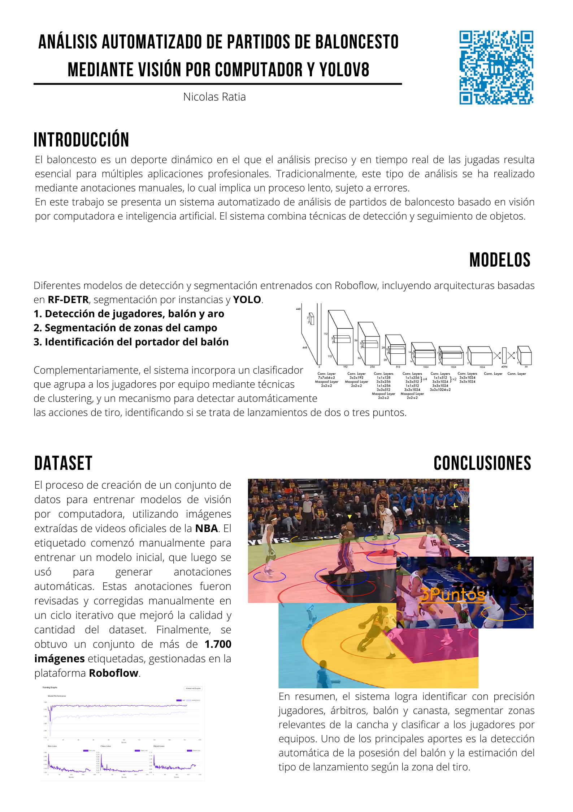

# Basketball Analytics

Este proyecto es una plataforma de análisis de videos de baloncesto que utiliza modelos de detección, clasificación y anotación para extraer información avanzada de partidos y jugadas. Permite identificar jugadores, equipos, balón, árbitros y zonas de la cancha, así como analizar jugadas y visualizar resultados de manera interactiva.



## Características principales

- **Detección de jugadores, balón, aro y árbitros** usando modelos de visión por computadora.
- **Clasificación automática de equipos** mediante embeddings y clustering.
- **Análisis de zonas de tiro** (2 o 3 puntos) y detección de jugadas clave.
- **Anotaciones visuales** sobre los frames del video (cajas, elipses, máscaras, texto estilo NBA, etc).
- **Extracción de frames** desde videos para análisis detallado.
- **Configuración flexible** mediante archivos en `config/`.

## Estructura del proyecto

- `nba-detection.py`: Script principal de procesamiento y anotación de videos.
- `models/`: Modelos de detección y clasificación.
- `processing/`: Lógica de anotaciones y análisis de zonas.
- `utils/`: Utilidades para manejo de video y visualización.
- `extra/`: Scripts adicionales (por ejemplo, extracción de frames).
- `config/`: Configuración de constantes y parámetros globales.
- `videos/`: Carpeta para videos de entrada y resultados.

## Requisitos

- Python 3.8+
- [requirements.txt](requirements.txt) con dependencias principales:
  - torch
  - supervision
  - transformers
  - umap-learn
  - scikit-learn
  - opencv-python
  - tqdm
  - python-dotenv

Instala las dependencias con:

```bash
pip install -r requirements.txt
```

## Uso

1. Coloca tu video en la carpeta `videos/test/`.
2. Configura los parámetros en `config/settings.py` y tu clave de API de Roboflow en un archivo `.env`:
   ```
   ROBOFLOW_API_KEY=tu_clave_aqui
   ```
3. Ejecuta el script principal:
   ```bash
   python nba-detection.py
   ```
4. Los resultados se guardarán en `videos/result/`.

### Extracción de frames

Para extraer frames de un video:

```bash
python extra/extract_frames.py videos/test/mi_video.mp4 --output frames --interval 5
```

## Créditos

- Modelos de visión: [Roboflow](https://roboflow.com/)
- Inspirado en proyectos de análisis deportivo y visualización avanzada.

## Licencia

MIT License.
